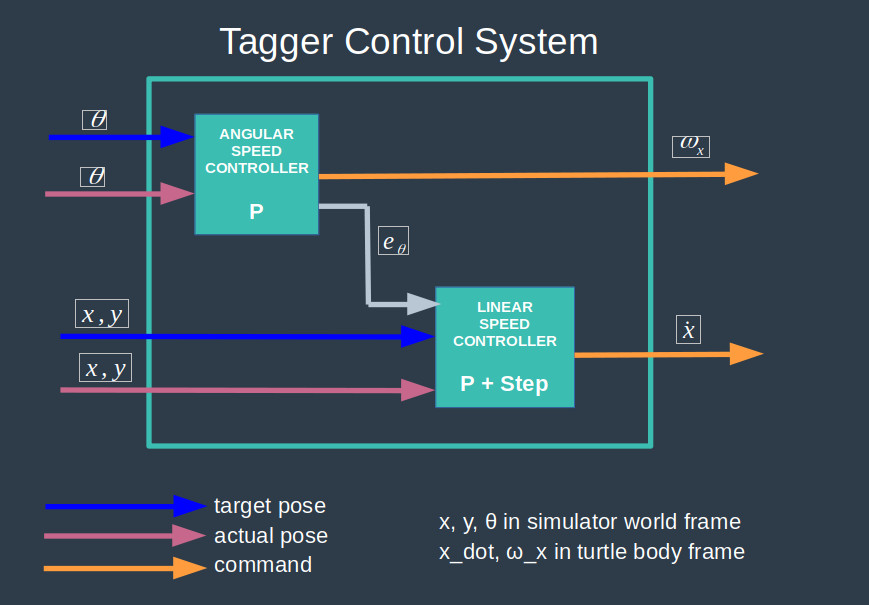

# ROS2 Turtle Tag Simulator

# Overview

This projet develops a small tag game simulator in ROS2 Foxy. In this simulator, a main turtle tagger needs to run after turtle players in order to tag them, which removes them from the simulator. The simulator is made of 3 ROS2 packages, ran using a single ROS2 launch file and built upon the turtlesim package.

This project is the capstone project in Udemy's course ROS2 For Beginners [1]. This README serves as a final report for this project.

# Install

Install instructions are for Linux Ubuntu 20.04.

### Install ROS2

1 - Install ROS2 Foxy, the colcon build tool and the turtlesim package.

    https://docs.ros.org/en/foxy/Installation/Ubuntu-Install-Debians.html

2 - Create and build your ROS2 workspace.

    cd
    mkdir ros2_ws
    cd ros2_ws
    colcon build

### Install Simulator

1 - Download this repository.

    cd
    mkdir github
    cd github
    git clone https://github.com/martin0004/ros2_turtle_tag_simulator.git

2 - Move the content of the repository into your ROS2 workspace src/ directory.

    cp -i ~/github/ros2_turtle_tag_simulator/packages_src/* ~/ros2_ws/src

### Build & Run Simulator

1 - Build simulator packages

    cd ~/ros2_ws
    colcon build --packages-select turtle_tag_simulator
    colcon build --packages-select turtle_tag_simulator_bringup
    colcon build --packages-select turtle_tag_simulator_interfaces

2 - Source the content of your workspace (assuming you are using bash).

    source ~/ros2_ws/install/setup.bash

3 - Run the simulator.

    ros2 launch turtle_tag_simulator_bringup turtle_tag_simulator.launch.py

4 - You should now see a turtle chasing other turtles.

# Terminology

| Term                        | Description            |
|:--------------------------------|:-----------------------|
| tagger            | Turtle which "hunts" other turtles in order to tag them. First turtle when the simulator is launched. Identified by namespace /turtle1.                  |
| player    | Any turtle which is being "hunted" by the turtle tagger. Players are spawned randomly in the simulator and identified by namespaces /player_1, /player_2, ...           |

# Simulator Architecture

### Overview

### Packages, Message Types, Service Types

| Packages                        | Description            |
|:--------------------------------|:-----------------------|
| turtle_tag_simulator            | Nodes                  |
| turtle_tag_simulator_bringup    | Launch file.           |
| turtle_tag_simulator_interfaces | Messages and services. |

| Message Types | Description                                   |
|:--------------|:----------------------------------------------|
| turtle_tag_simulator/msg/Turtle        | Name and pose of any turtle in the simulator. |
| turtle_tag_simulator/msg/Turtles       | Array of Turtle messages.                     |

| Service Types | Description                                  |
|:--------------|:---------------------------------------------|
| turtle_tag_simulator/srv/DeleteTurtle  | Name of turtle to be deleted from simulator. |

### Nodes, Topics, Services

| Nodes                  | Description                              |
|:-----------------------|:-----------------------------------------|
| /turtlesim             | ROS2 turtle simulator.                   |
| /players_spawner       | Adds new players randomly in simulation. |
| /tagger_control_system | Sends velocity commands to tagger.       |

| Topics            | Message Type                     | Description                                     |
|:------------------|:---------------------------------|:------------------------------------------------|
| /players          | turtle_tag_simulator/msg/Turtles | Players currently in the simulator.             |
| /player_X/pose    | turtlesim/msg/Pose               | Player X pose & velocities.                     |
| /player_X/cmd_vel | geometry_msgs/msg/Twist          | Player X linear and angular velocities command. |
| /turtle1/pose     | turtlesim/msg/Pose               | Tagger pose & velocities                        |
| /turtle1/cmd_vel  | geometry_msgs/msg/Twist          | Tagger linear and angular velocities command.   |

| Services         | Description |
|:-----------------|-------------|
| /delete_turtle   | Remove tagged turtle from simulator. |
| /kill            | Remove tagged turtle from simulator   (service from turtlesim, used under the hood by /delete_turtle) |
| /spawn           | Add player in simulation   (service from turtlesim). |

# Tagger Control System

(This section goes way beyond the requirements of this project, but since I like control theory I just documented all the PID stuff... :)  )

The control system for moving the turtle tagger is implemented in node `/tagger_control_system`. This control system is quite simple and made of only 2 P controllers, one for angular velocity, one for linear velocity.

The tagger kinematic constraints are as follows:

- can rotate about its z axis
- can only move forward / backwards (not sideways)

Additionnaly, the linear velocity controller is only activated if the pose angle error is small, which avoids having the turtle speed up ahead when it is not facing its target location. This is implemented by a step function inside the linear velocity controller.

# Possible Improvements

- Modify the Turtle message definition so it uses the turtlesim/msg/Pose message. This would create a consistency between all types of poses used in this project.
- ...

# References

[1] Udemy, Edouard Renard, ROS2 For Beginners (ROS Foxy - 2021), https://www.udemy.com/course/ros2-for-beginners/

